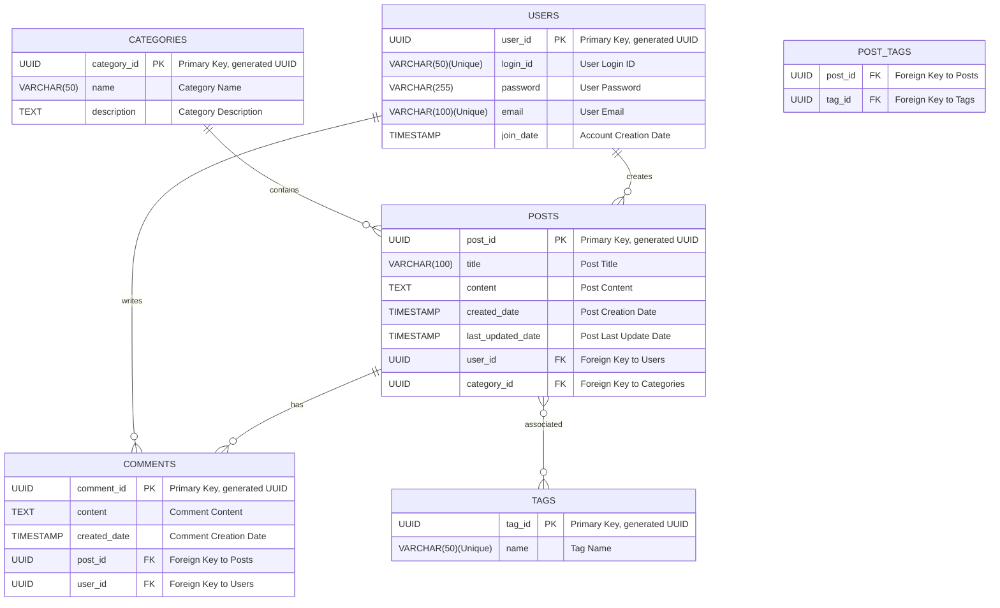

```mermaid
erDiagram
    USERS {
        UUID user_id PK "Primary Key, generated UUID"
        VARCHAR(50)(Unique) login_id "User Login ID"
        VARCHAR(255) password "User Password"
        VARCHAR(100)(Unique) email "User Email"
        TIMESTAMP join_date "Account Creation Date"
    }
    CATEGORIES {
        UUID category_id PK "Primary Key, generated UUID"
        VARCHAR(50) name "Category Name"
        TEXT description "Category Description"
    }
    POSTS {
        UUID post_id PK "Primary Key, generated UUID"
        VARCHAR(100) title "Post Title"
        TEXT content "Post Content"
        TIMESTAMP created_date "Post Creation Date"
        TIMESTAMP last_updated_date "Post Last Update Date"
        UUID user_id FK "Foreign Key to Users"
        UUID category_id FK "Foreign Key to Categories"
    }
    COMMENTS {
        UUID comment_id PK "Primary Key, generated UUID"
        TEXT content "Comment Content"
        TIMESTAMP created_date "Comment Creation Date"
        UUID post_id FK "Foreign Key to Posts"
        UUID user_id FK "Foreign Key to Users"
    }
    TAGS {
        UUID tag_id PK "Primary Key, generated UUID"
        VARCHAR(50)(Unique) name "Tag Name"
    }
    POST_TAGS {
        UUID post_id FK "Foreign Key to Posts"
        UUID tag_id FK "Foreign Key to Tags"
    }

    USERS ||--o{ POSTS : creates
    POSTS ||--o{ COMMENTS : has
    USERS ||--o{ COMMENTS : writes
    CATEGORIES ||--o{ POSTS : contains
    POSTS }o--o{ TAGS : associated
```
